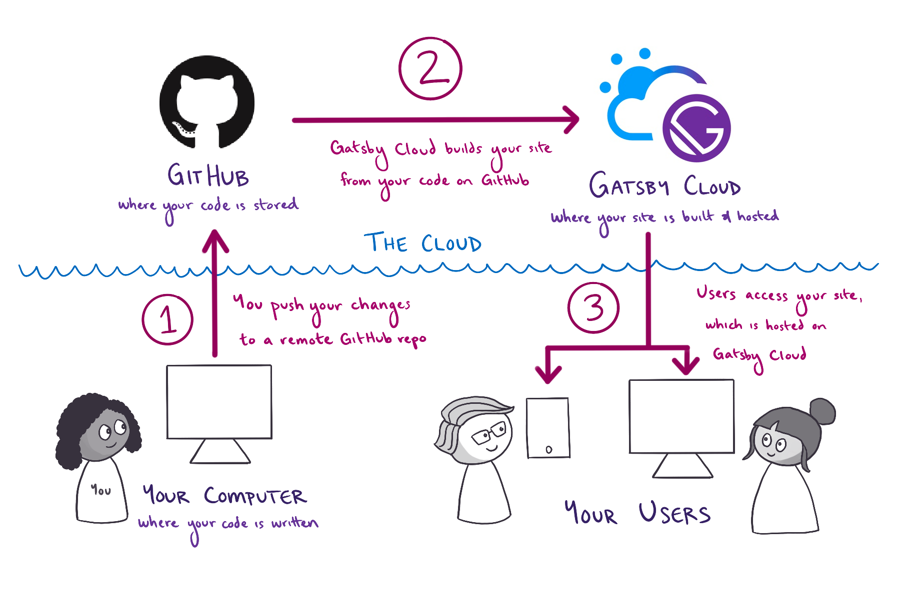
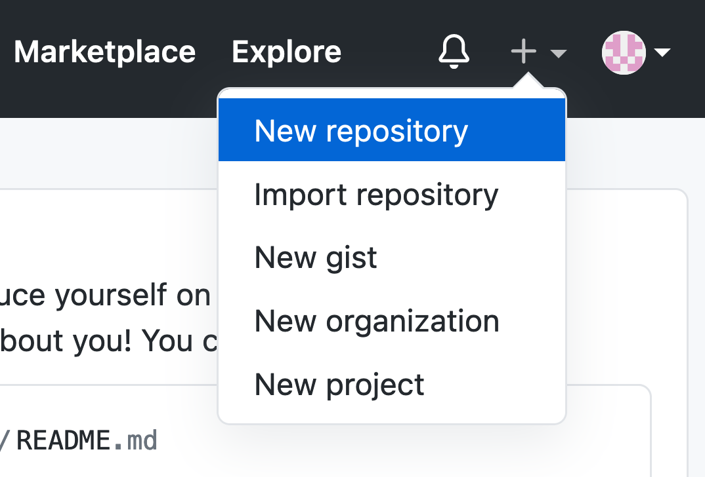
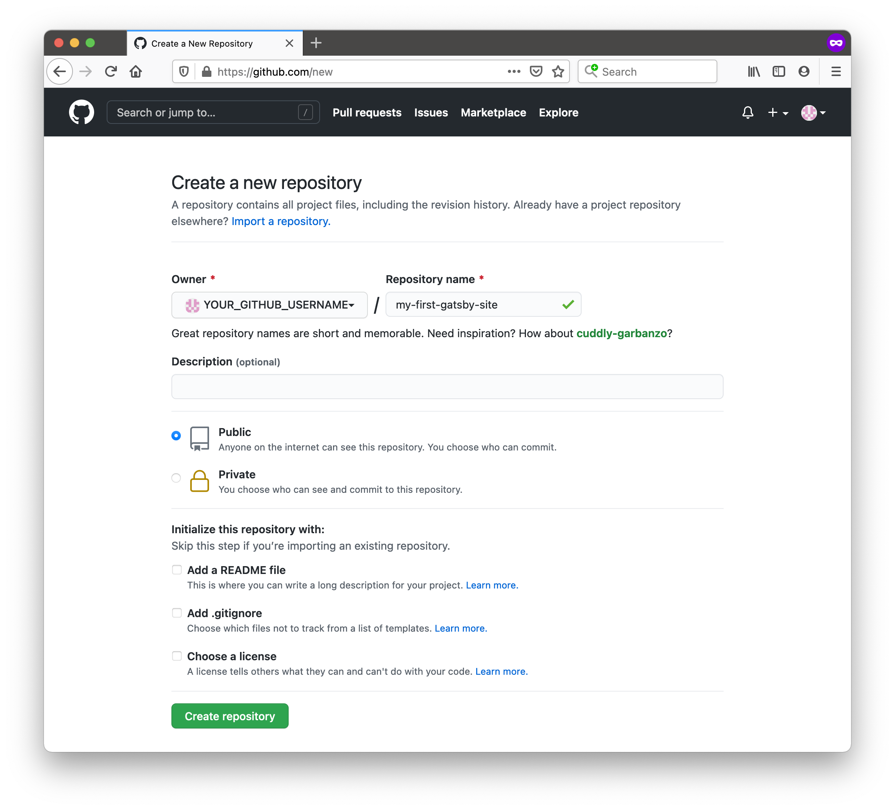

## Introduction

PASS.



> **Expand for detailed description**
>
> 먼저 컴퓨터에서 Gatsby 사이트의 코드를 작성합니다.인터넷에서 변경 사항을 실시 할 준비가되면 다음 단계를 살펴 봅니다.
>
> 1. 컴퓨터에서 GitHub의 원격 저장소로 변경 사항을 푸시합니다. Github는 프로젝트 코드를 저장하기위한 온라인 플랫폼입니다.
> 2. Netlify는 변경 사항을 위해 Github 저장소를 시청합니다.새로운 변경 사항이 표시되면 NetLify는 GitHub의 코드에서 사이트를 구축합니다.
> 3. NetLify는 사용자가 사이트의 최신 버전에 액세스하는 데 사용할 수있는 고유 한 URL에서 사이트의 완성 된 버전을 호스팅합니다.

## Create a Gatsby site

Install `gatsby-cli`:

```shell
npm install -g gatsby-cli
```

1.  Create a new Gatsby site.

    ```shell
    gatsby new
    ```

    이 후, 질문에 응답을 하면서 진행합니다.

PASS.

## Run your site locally

Run serve:

```shell
gatsby develop
```

Result:

```shell
You can now view my-first-gatsby-site in the browser.
⠀
  http://localhost:8000/
⠀
View GraphiQL, an in-browser IDE, to explore your site's data and
schema
⠀
  http://localhost:8000/___graphql
```

Open your favorite web browser and navigate to `http://localhost:8000`.

## Set up a GitHub repo for your site

코드 를 GitHub에 업로드하면 여러 컴퓨터에서 동일한 코드베이스에서 작업 할 수 있습니다. 또한 NetLify를 사용하여 사이트를 구축하고 호스팅 할 수 있습니다.

1.  Create new GitHub remote repo.

    

2.  Can deploy the public and the privacy remote repo.

    

3.  Push local repo to remote repo.

    ```shell
    git remote add origin https://github.com/YOUR_GITHUB_USERNAME/YOUR_GITHUB_REPO_NAME.git
    git branch -M main
    git push -u origin main
    ```

Next up is to deploy your site to Netlify, which you can do by following the docs here: [Gatsby on Netlify](https://docs.netlify.com/integrations/frameworks/gatsby/).

## Summary

이 섹션에서는 새로운 Gatsby 사이트를 만들고 NetLify를 사용하여 온라인으로 배포하는 방법을 배웠습니다.빠른 검토로 프로세스를 요약하는 다이어그램은 다음과 같습니다.


<Collapsible
summary={<em>Expand for detailed description</em>}

>

First, you write the code for your Gatsby site from your computer. When you're ready to make your changes live on the internet, you go through the following steps:

1. You push your changes from your computer to a remote repository on GitHub. GitHub is an online platform for storing code for your projects.
1. Netlify watches your GitHub repository for changes. When it sees your new changes, Netlify builds your site from your code on GitHub.
1. Netlify hosts the finished version of your site at a unique URL, which users can use to access the latest version of your site.

</Collapsible>

### Key takeaways

- 명령 줄에서 새 Gatsby 사이트를 만들려면`Gatsby New` 명령을 실행할 수 있습니다.
- 사이트를 로컬로 운영하려면`Gatsby Develop` 명령을 사용하십시오. `localhost:8000` 의 웹 브라우저에서 사이트를 볼 수 있습니다.
- NetLify는 Gatsby 사이트 및 기타 프레임 워크를 구축, 배포 및 호스팅 할 수있는 인프라 플랫폼입니다.
- 사이트의 GitHub 저장소의 `main` 지점에 새로운 커밋을 추진하면 Netlify 는 변경 사항을 감지하고 사이트의 새 버전을 재건 한 다음 재배치합니다.

### What's coming next?

PASS.
